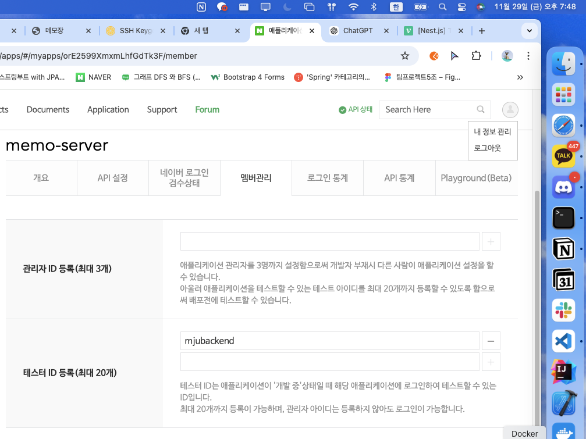
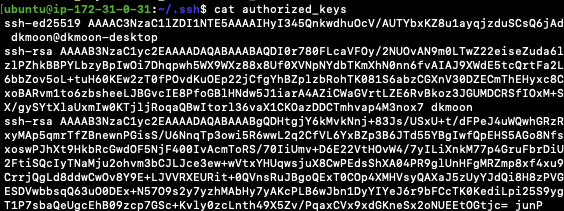
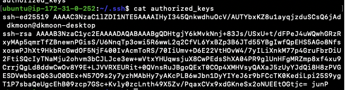

## 실행 방법

### 필요 패키지 설치
```
pip install -r requirements.txt 
```
### local
```
python3 memo.py 
```
그 다음
```
http://localhost:8000
```

### aws 상에 동작하고 있는 환경
```
http://memo-lb-1076248375.ap-northeast-2.elb.amazonaws.com/memo
```
## 코드 설명
### 주요 라우트
## __GET / (홈페이지)__

쿠키에 저장된 userId를 통해 로그인 여부를 확인합니다.
로그인된 경우 Redis에서 사용자 이름을 가져와 메인 페이지(index.html)를 렌더링합니다.
## __GET /login (로그인 요청)__

네이버 로그인 페이지로 리다이렉트합니다.

## __GET /auth (OAuth 리다이렉션)__

네이버에서 전달받은 authorization_code로 access_token을 요청합니다.
액세스 토큰을 사용해 사용자 프로필 정보를 가져옵니다.
사용자 정보를 Redis에 저장하고, 세션 쿠키를 설정한 뒤 메모 페이지(/memo)로 리다이렉트합니다.
## __GET /memo (메모 목록 조회)__

현재 로그인된 사용자 정보를 Redis 세션에서 확인합니다.
Redis에서 사용자 메모를 가져와 JSON 형식으로 반환합니다.
## __POST /memo (새 메모 저장)__

JSON으로 전달된 메모 내용을 Redis에 저장합니다.
로그인이 되어 있지 않으면 홈으로 리다이렉트합니다.


### 접근 권한 부여 확인


